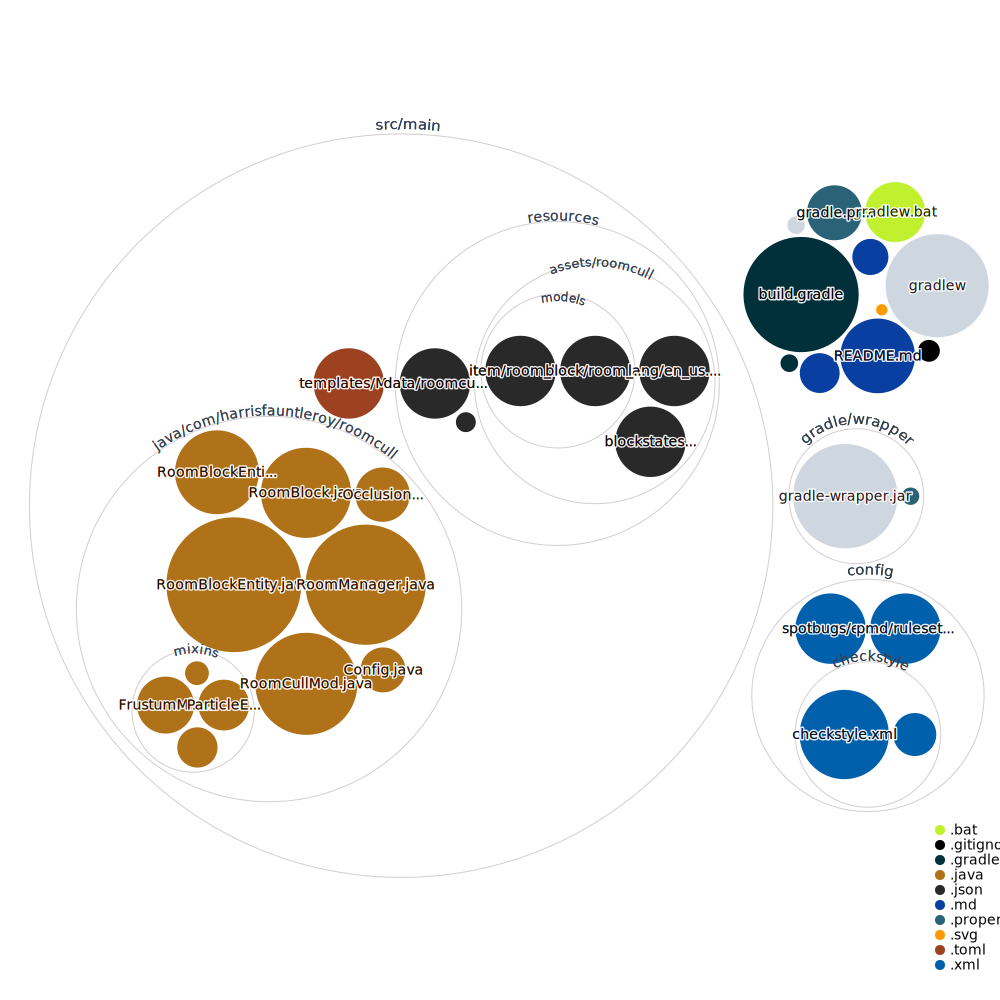

# RoomCull

Room-based occlusion culling for Minecraft 1.21.1

[](https://github.com/harrisfauntleroy/RoomCull/releases)
[](https://github.com/harrisfauntleroy/RoomCull/issues)
[](LICENSE)

Performance optimization mod that implements intelligent room-based occlusion culling. Detects room boundaries and creates frustum planes to hide non-visible geometry in enclosed spaces.

## Getting Started

### Prerequisites

- Java 21
- Minecraft 1.21.1
- NeoForge 21.0.167

### Development Setup

```bash
git clone https://github.com/harrisfauntleroy/roomcull.git
cd roomcull
./gradlew genIntellijRuns
```

### Build and Test

```bash
# Build mod
./gradlew build

# Run client
./gradlew runClient

# Run server
./gradlew runServer
```

## Core Features

- **Automatic Room Detection** - Scans walls, floors, ceilings in real-time
- **6-Plane Frustum Culling** - Creates frustum planes at room boundaries

## Technical Implementation

- **Language**: Java 21
- **Platform**: NeoForge 21.0.167
- **Integration**: Mixin-based rendering system hooks
- **Build**: Gradle with ModDev plugin

Room detection algorithm:

1. Raycast in 6 directions from player position
2. Identify solid block boundaries
3. Generate frustum planes at detected boundaries
4. Apply occlusion culling to hidden geometry

## Publishing

Create release with version tag:

```bash
git tag v1.0.0
git push origin v1.0.0
```

GitHub Actions automatically builds and publishes to:

- GitHub Releases
- CurseForge (requires `CURSEFORGE_PROJECT_ID`, `CURSEFORGE_API_TOKEN`)
- Modrinth (requires `MODRINTH_PROJECT_ID`, `MODRINTH_API_TOKEN`)

Set repository secrets in Settings → Secrets and variables → Actions.

## Contributing

1. Fork the repository
2. Create feature branch (`git checkout -b feature/name`)
3. Commit changes (`git commit -m 'Description'`)
4. Push branch (`git push origin feature/name`)
5. Open Pull Request

## License

MIT License. See [LICENSE](LICENSE) for details.

---

For NeoForge documentation: <https://docs.neoforged.net/>

---


