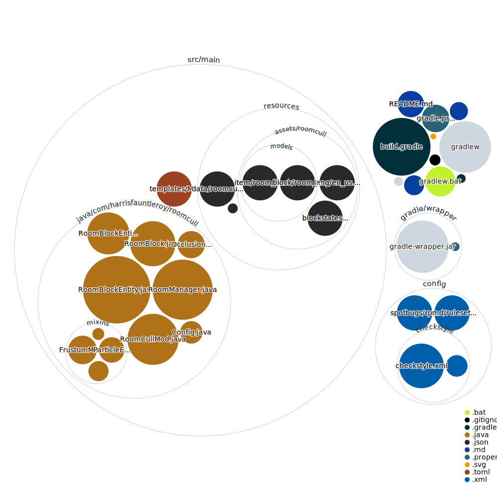

# RoomCull

<div align="center">
    <h3>Room-based occlusion culling for Minecraft 1.21.1</h3>
</div>

<p align="center">
    <a href="https://github.com/harrisfauntleroy/roomcull/releases">
        
    </a>
    <a href="https://github.com/harrisfauntleroy/roomcull/issues">
        
    </a>
    <a href="https://github.com/harrisfauntleroy/roomcull/commits">
        
    </a>
    <a href="/LICENSE">
        
    </a>
    <a href="https://github.com/harrisfauntleroy/roomcull/graphs/contributors">
        
    </a>
</p>

RoomCull is a performance optimization mod for Minecraft 1.21.1 that implements intelligent room-based occlusion culling. By detecting room boundaries and creating frustum planes at walls, floors, and ceilings, RoomCull dramatically improves rendering performance by hiding geometry that shouldn't be visible from the player's current position within enclosed spaces.

Perfect for large builds, underground bases, and complex interior structures where traditional frustum culling isn't enough to maintain smooth framerates.

## ✨ Key Features

- **Automatic Room Detection** - Scans in all directions to detect walls, floors, and ceilings
- **6-Plane Frustum Culling** - Creates proper frustum planes at room boundaries 
- **Real-time Boundary Updates** - Periodically rescans for changes in room structure
- **Visual Debug Particles** - Red redstone particle beams show detected room boundaries
- **Glowstone Room Block** - Place to define room centers and enable occlusion culling
- **Performance Optimized** - Minimal overhead with intelligent caching and cleanup

## 🎮 How It Works

1. **Place Room Blocks** - Place the glowing room block at the center of enclosed spaces
2. **Automatic Detection** - The mod scans up to 50 blocks in each direction to find walls
3. **Frustum Creation** - Creates 6 culling planes at the detected room boundaries
4. **Selective Rendering** - Only renders geometry inside the room when you're inside it
5. **Visual Feedback** - See red particle beams showing the detected room boundaries

## 🚀 Installation

### For Players

1. Download the latest release for Minecraft 1.21.1 from the [Releases](https://github.com/harrisfauntleroy/roomcull/releases) page
2. Install [NeoForge](https://neoforged.net/) for Minecraft 1.21.1
3. Place the downloaded `.jar` file in your Minecraft `mods` folder
4. Launch Minecraft with NeoForge

### For Developers

1. Clone this repository:
   ```bash
   git clone https://github.com/harrisfauntleroy/roomcull.git
   ```
2. Open in your preferred IDE (IntelliJ IDEA recommended)
3. Generate run configurations:
   ```bash
   ./gradlew genIntellijRuns
   ```

## 🛠️ Building and Running

### Build the mod:
```bash
./gradlew build
```

### Run the client for testing:
```bash
./gradlew runClient
```

### Run the dedicated server:
```bash
./gradlew runServer
```

### Clean build artifacts:
```bash
./gradlew clean
```

## 🎯 Usage

1. **Craft Room Blocks** - Find them in the Building Blocks creative tab
2. **Place Strategically** - Put room blocks at the center of enclosed spaces
3. **Watch Performance** - Enjoy improved framerates in complex interior builds
4. **Debug Visualization** - Red particle beams show detected room boundaries every 2 seconds

## 🛠️ Tech Stack

- **Minecraft**: 1.21.1
- **Mod Loader**: NeoForge 21.0.167
- **Language**: Java 21
- **Build System**: Gradle with ModDev plugin
- **Mixins**: For low-level rendering system integration

## 🤝 Contributing

Contributions are welcome! Whether you're reporting bugs, requesting features, or submitting code improvements:

1. Fork the repository
2. Create a feature branch (`git checkout -b feature/amazing-feature`)
3. Commit your changes (`git commit -m 'Add amazing feature'`)
4. Push to the branch (`git push origin feature/amazing-feature`)
5. Open a Pull Request

## 📜 License

This project is licensed under the MIT License. See the [LICENSE](LICENSE) file for details.

## 🔗 Additional Resources

- [NeoForge Documentation](https://docs.neoforged.net/)
- [NeoForge Discord](https://discord.neoforged.net/)
- [Minecraft Forge Modding](https://mcforge.readthedocs.io/)

---

